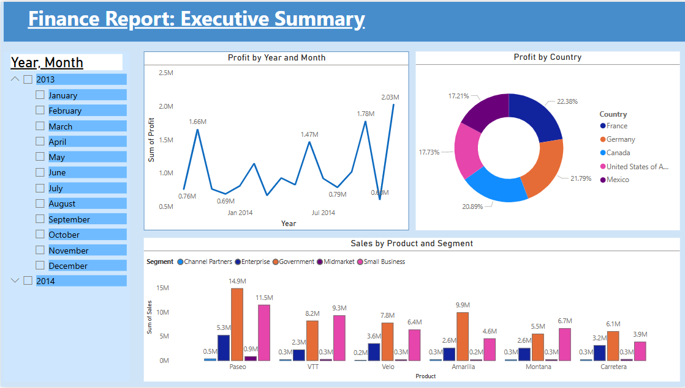

- 👋 Hi, I’m @Pooja88-jangid

# Finance Dashboard - Executive Summary

This dashboard analyzes profit by year, month, country, and product segment.

## Key Visuals:
- 📈 Line Chart: Profit trend over time
- 🥧 Pie Chart: Profit by Country
- 📊 Bar Chart: Sales by Product & Segment

## Tools Used:
- Microsoft Power BI
- Microsoft Excel

## Created By:
*Pooja Jangid*

## Screenshot:

## 📂 Data Source
The dashboard is built using the data provided in [FinanceData.xlsx](FinanceData.xlsx).
